# Autonomous Semantic 3D Reconstruction and High-Fidelity Mapping
## Architecture Flowchart

```mermaid
flowchart TD
    %% Start
    Start([🚁 UAV Deployment<br/>Initial Position]) --> Stage1{{"🎯 STAGE 1<br/>Real-Time Semantic Spatial<br/>Reconstruction & Exploration"}}
    
    %% Stage 1: Real-Time Semantic Spatial Reconstruction
    Stage1 --> A[📹 Image Data Acquisition<br/>+ IMU Data Collection]
    
    A --> B[🗺️ Real-Time Point Cloud Generation<br/>Visual-Inertial SLAM<br/>SLAM3R or LIDAR-based]
    
    B --> C[🧠 Semantic Spatial Understanding<br/>SpatialLM Deep Learning Model<br/>Dense Semantic Segmentation]
    
    C --> D[🤖 Agent-Based Active Vision<br/>& Map Integration]
    
    D --> E{🗺️ Update Global<br/>Semantic Navigation Map}
    
    E --> F[🎯 Next-Best-View Planning<br/>& Optimization<br/>Information Gain Maximization]
    
    F --> G[📍 UAV Actuation<br/>Motion Commands<br/>to Target Pose]
    
    G --> H{📊 Convergence Check<br/>Stable Semantic Understanding?<br/>Minimal New Info Gain?}
    
    H -->|No| A
    H -->|Yes| I{🚪 Region Complete?<br/>Explore Adjacent Areas?}
    
    I -->|More Regions| J[🧭 Frontier-Based Exploration<br/>Navigate to Unmapped Regions<br/>Semantic Priors: Doorways/Corridors]
    J --> A
    
    I -->|All Regions Mapped| K[🏠 Return to Initial Position]
    K --> Stage2{{"📸 STAGE 2<br/>Targeted High-Fidelity<br/>Photogrammetric Reconstruction"}}
    
    %% Stage 2: High-Fidelity Photogrammetric Reconstruction
    Stage2 --> L[📋 Semantically-Informed<br/>Viewpoint Planning<br/>Optimize for Photogrammetry]
    
    L --> M[📐 Generate Viewpoint Plan<br/>Object Boundaries Analysis<br/>Surface Planarity Assessment<br/>Coverage & Overlap Optimization]
    
    M --> N[📸 High-Resolution<br/>Image Acquisition<br/>Systematic Trajectory Execution]
    
    N --> O{🔄 All Viewpoints<br/>Captured?}
    O -->|No| N
    O -->|Yes| P{⚡ Processing Method<br/>Selection}
    
    %% Processing Alternatives
    P -->|Traditional| Q[🏗️ Traditional Photogrammetry<br/>Multi-View Stereo MVS<br/>RealityCapture Processing]
    P -->|Neural| R[🧠 Neural Rendering<br/>NeRF and 3D Gaussian Splatting<br/>NUHA AI Processing]
    
    Q --> S[🎨 Dense 3D Model Generation<br/>Textured Mesh Output]
    R --> T[✨ High-Fidelity Scene<br/>Representation<br/>Novel View Synthesis Capability]
    
    %% Final Outputs
    S --> U[🌐 Model Optimization<br/>& Web Deployment]
    T --> U
    
    U --> V{📱 Interactive Visualization<br/>Platform Selection}
    
    V -->|Gaussian Splatting| W[💫 SuperSplat Viewer<br/>Interactive Exploration]
    V -->|Mesh/Point Cloud| X[🖼️ Sketchfab/Potree Viewer<br/>Immersive Analysis]
    
    W --> End([🎉 Digital Twin<br/>Complete])
    X --> End
    
    %% Styling
    classDef stage1 fill:#e1f5fe,stroke:#01579b,stroke-width:3px
    classDef stage2 fill:#f3e5f5,stroke:#4a148c,stroke-width:3px
    classDef decision fill:#fff3e0,stroke:#e65100,stroke-width:2px
    classDef process fill:#e8f5e8,stroke:#1b5e20,stroke-width:2px
    classDef output fill:#fce4ec,stroke:#880e4f,stroke-width:2px
    
    class Stage1,A,B,C,D,E,F,G,J,K stage1
    class Stage2,L,M,N,Q,R,S,T,U stage2
    class H,I,O,P,V decision
    class Start,End output
```

## Architecture Components Overview

### 🎯 Stage 1: Real-Time Semantic Spatial Reconstruction
- **Real-Time Processing**: Visual-inertial SLAM for metric-scale point cloud generation
- **Semantic Understanding**: SpatialLM for dense semantic segmentation and spatial relationships
- **Autonomous Navigation**: Agent-based active vision with next-best-view planning
- **Iterative Refinement**: Continuous map updates until convergence criteria are met
- **Multi-Region Exploration**: Systematic exploration using frontier-based strategies

### 📸 Stage 2: Targeted High-Fidelity Photogrammetric Reconstruction
- **Intelligent Planning**: Semantic map-informed viewpoint optimization
- **High-Quality Acquisition**: Systematic high-resolution image capture
- **Dual Processing Paths**: 
  - Traditional photogrammetry (MVS algorithms)
  - Neural rendering (NeRF/3D Gaussian Splatting)
- **Interactive Deployment**: Web-based visualization platforms

### 🔄 Key Iterative Processes
1. **Stage 1 Main Loop**: Image acquisition → SLAM → semantic understanding → NBV planning → UAV movement
2. **Region Exploration**: Continues until convergence, then moves to adjacent areas
3. **Stage 2 Capture Loop**: Systematic execution of planned viewpoints

### 🎯 Decision Points
- **Convergence Check**: Determines when local area mapping is complete
- **Region Completion**: Decides whether to explore new areas or proceed to Stage 2

---

## 🎁 Concrete Expected Results (Artifacts)

### 📊 Primary Deliverables

#### 🗺️ Stage 1 Outputs
| Artifact | Format | Specifications | Purpose |
|----------|--------|---------------|---------|
| **Semantic Point Cloud** | PLY/PCD with labels | 5mm resolution, >95% accuracy | Spatial understanding |
| **Navigation Map** | ROS occupancy grid | 2cm resolution, 90%+ coverage | Autonomous exploration |
| **Flight Trajectory** | CSV/JSON | 100Hz pose data | Mission analysis |

#### 📸 Stage 2 Outputs
| Artifact | Format | Specifications | Purpose |
|----------|--------|---------------|---------|
| **Image Dataset** | RAW/JPEG + EXIF | 20MP, 200-2000 images | Photogrammetry input |
| **3D Mesh Model** | OBJ/glTF + textures | <5cm accuracy, 4K-8K textures | Traditional reconstruction |
| **Neural Model** | NeRF/3DGS | 10-300MB, real-time rendering | Advanced visualization |
| **Web Viewer** | Interactive HTML | 30+ FPS, mobile compatible | Public deployment |

### 📈 Quality Assurance Outputs
- **Accuracy Reports**: .MD + CSV with statistical analysis
- **Performance Benchmarks**: HTML dashboard with metrics
- **Mission Documentation**: Complete flight logs and system status

---

## 📋 Key System Requirements Summary

### ⚡ Performance Requirements
- **Stage 1 Mapping**: 3-5 minutes per room
- **Stage 2 Capture**: 500 viewpoints in 30 minutes  
- **Reconstruction Time**: 4-12 hours processing
- **Real-time Performance**: 30+ Hz SLAM, 30+ FPS web viewer

### 🎯 Accuracy Requirements  
- **SLAM Precision**: <10cm positional error
- **Semantic Accuracy**: >90% classification (mIoU)
- **Reconstruction Accuracy**: >0.8 SSIM
- **Coverage**: >95% area mapping completeness

### 🔒 Operational Requirements
- **Flight Duration**: 20+ minutes autonomous operation
- **Environmental Robustness**: 95% lighting conditions

### 📱 Deployment Requirements
- **Cross-Platform**: Windows, Linux, macOS support
- **Web Compatibility**: depending on size Modern browsers, mobile devices or only pc
- **Scalability**: Up to 10,000m³ environments

This architecture provides a scientifically grounded approach for comprehensive environmental understanding and digital twin creation. 

---

## 🛠️ Planned Functionality Before Next Review

Before the next project review, the following key functionalities are planned:

- **Agentic Model Rule Design**: Define and formalize the operational rules and decision logic for the agent-based system, ensuring robust and adaptive behavior in dynamic environments.
- **SLAM & SpatialLM Testing**: Conduct comprehensive tests of the selected SLAM algorithm and the SpatialLM semantic model, focusing on accuracy, robustness, and integration feasibility.
- **Response Time Evaluation**: Measure and analyze the response times of both the SLAM and SpatialLM components to ensure real-time or near-real-time performance requirements are met.
- **Cloud Deployment**: Deploy the SLAM and SpatialLM modules to a cloud environment, validating scalability, accessibility, and performance under realistic network conditions.

# Team Formation (deadline 9th-05-2025)
## the delay because the summer semester of second year student start at 1th-05-2025, and first capastone project session at 5th.
